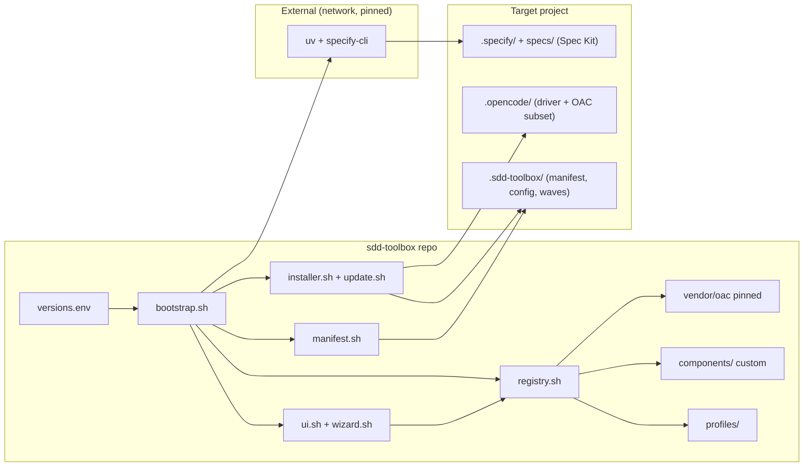
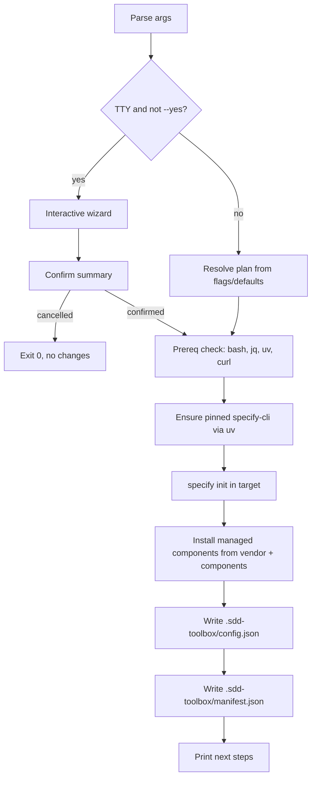
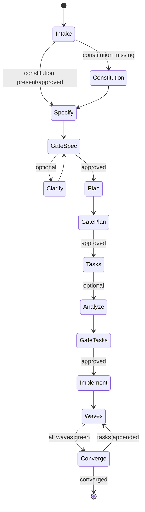

# Design: SDD Toolbox

**Phase**: 2 — Design
**Status**: DRAFT — awaiting owner review (Phase 2 checkpoint)
**Spec**: `.kiro/specs/sdd-toolbox`
**Inputs**: `requirements.md` (approved), Spec Kit official docs (verified 2026-09-19), OAC registry schema v2.0.0 (from OAC context files)

---

## 1. Overview & Goals

`sdd-toolbox` deterministically bootstraps opencode-based SDD tooling into a
target project:

1. **Spec Kit integration** — official `specify` CLI, pinned version
2. **Vendored OAC subset** — pinned, bundled, no network dependency
3. **`spec-kit-driver` agent** — gates + wave execution on top of Spec Kit
4. **Ownership manifest + update machinery** — safe, idempotent, auditable

### Design principles

- **Deterministic and offline for toolbox-owned content.** Only the pinned
  Spec Kit CLI install touches the network.
- **Explicit ownership.** Every file the toolbox writes is tracked in a
  manifest with content hashes; unmanaged files are never touched.
- **Runtime choice.** The interactive wizard enumerates every option from
  data, not hardcoded lists; defaults apply only to non-interactive runs.
- **Catalog compatibility, not runtime coupling.** The registry uses OAC's
  schema for discoverability, but bootstrap does *not* invoke OAC's
  `install.sh` (rejected: network-dependent, less deterministic — see §15).
- **Bash 3.2+ compatible** (macOS system bash), Linux + macOS. `jq` required;
  `gum`/`fzf` optional enhancements only.

---

## 2. Verified Facts (drive the design)

### Spec Kit (official docs, fetched 2026-09-19)

| Fact | Detail |
|---|---|
| Pinned install | `uv tool install specify-cli --from git+https://github.com/github/spec-kit.git@vX.Y.Z` (recommended) or `uv tool install specify-cli==X.Y.Z` (PyPI) |
| Prereqs | `uv` (recommended) or `pipx`; Python 3.11+; git optional |
| Init (new dir) | `specify init <name> --integration opencode --script sh --non-interactive` |
| Init (existing dir) | `specify init --here --force --non-interactive --integration opencode` (merge; may replace conflicting *managed* paths) |
| Project marker | `.specify/` at project root (templates, scripts, constitution, extension config) |
| Feature dirs | `specs/[###-feature-name]/` (`spec.md`, `plan.md`, `tasks.md`, `research.md`, `data-model.md`, `contracts/`); active feature resolved via `.specify/feature.json` / `SPECIFY_FEATURE_DIRECTORY` |
| Tasks format | `- [ ] T001 [P] [US1] Description (depends on T012, T013)` — `[P]` = parallel-safe; explicit dependency refs in prose; phases: Setup → Foundational → User Story N → Polish |
| Agentic commands | `constitution, specify, clarify, checklist, plan, tasks, analyze, implement, converge` (+ `taskstoissues`, GitHub-specific) |
| Bug flow | Opt-in extension: `specify extension add bug`; `.specify/bugs/<slug>/`; verdicts verified/partial/failed |
| Converge | `/speckit.converge` assesses code vs artifacts and appends remaining tasks; repeat implement → converge until complete |
| CLI checks | `specify version`, `specify check`, `specify self check` |

### OAC (registry context v2.0.0)

| Fact | Detail |
|---|---|
| Registry schema | `{version, schema_version, components:{agents,subagents,commands,tools,contexts}, profiles:{...}}` |
| Component entry | `{id, name, type, path, description, category, tags, dependencies:["type:id"], version}` |
| Paths | `.opencode/agent/{category}/*.md`, `.opencode/agent/subagents/**/*.md`, `.opencode/command/**/*.md`, `.opencode/context/**/*.md` |
| Frontmatter | `description`, `category`, `type`, `tags` (required for OAC auto-detect) |
| Available subagents (this install) | `code/{build-agent, coder-agent, reviewer, test-engineer}`, `core/{batch-executor, contextscout, documentation, externalscout, task-manager}`, `development/{devops-specialist, frontend-specialist}`, `system-builder/context-organizer` |
| Collision handling | skip / overwrite / backup semantics already conventional in OAC |

---

## 3. Repository Layout (sdd-toolbox)

```
sdd-toolbox/
├── bootstrap.sh                  # single entry point
├── lib/                          # sourced bash modules
│   ├── ui.sh                     # prompts, menus, gum detection, logging
│   ├── wizard.sh                 # interactive screens + flow (uses ui.sh)
│   ├── args.sh                   # flag parsing + help
│   ├── prereqs.sh                # bash/jq/uv/network checks
│   ├── spec_kit.sh               # specify CLI install + init + extension wrapper
│   ├── registry.sh               # registry/profiles loading, component resolution
│   ├── manifest.sh               # manifest read/write, sha256 helpers
│   ├── installer.sh              # copy engine, collision + backup logic
│   └── update.sh                 # update/reinstall/diff/plan logic
├── versions.env                  # OAC_VERSION, SPEC_KIT_VERSION (single pin place)
├── registry.json                 # custom components + extension catalog (OAC schema)
├── profiles/
│   ├── minimal.json
│   └── go-backend.json
├── components/                   # custom (toolbox-owned) components
│   ├── agent/core/spec-kit-driver.md
│   ├── command/sdd.md
│   └── context/spec-kit/
│       ├── navigation.md
│       ├── workflow.md
│       ├── artifacts.md
│       ├── wave-execution.md
│       └── evidence.md
├── vendor/oac/                   # pinned OAC subset (mirrors .opencode/ layout)
│   ├── bundle.json               # version + component list + hashes + provenance
│   └── .opencode/…
├── scripts/
│   ├── validate.sh               # registry/profiles/references/frontmatter checks
│   ├── smoke-test.sh             # end-to-end bootstrap scenarios (§14)
│   └── vendor-sync.sh            # maintainer tool: refresh vendored subset
└── README.md
```

### Target project (after bootstrap)

```
<target>/
├── .specify/                     # Spec Kit-owned (never touched by toolbox)
├── specs/                        # Spec Kit feature artifacts (never touched)
├── .opencode/                    # Spec Kit integration + toolbox-managed files
├── .sdd-toolbox/
│   ├── manifest.json             # toolbox-owned: versions + managed files + hashes
│   ├── config.json               # runtime settings (§11)
│   ├── waves/<feature>.json      # wave sidecars (§10.3)
│   └── backup/<timestamp>/       # pre-overwrite backups on Reinstall
```

---

## 4. Component Architecture



---

## 5. Bootstrap Flow

### 5.1 Argument surface

```
bootstrap.sh [<target-dir>] [OPTIONS]
  --profile <name>     non-interactive profile selection
  --yes                assume yes; disables all prompts (implies non-interactive)
  --update             update mode (existing manifest required)
  --force              with --update: reinstall mode (overwrite modified files)
  --dry-run            print planned actions, write nothing
  --no-spec-kit        skip Spec Kit stages (toolbox overlay only)
  --help               usage
```

### 5.2 Execution stages



**Stage semantics**

| Stage | Writes | On failure |
|---|---|---|
| Prereq check | nothing | exit 3, actionable install hints; no changes |
| ensure specify-cli | user toolchain (via uv) | exit 5; target untouched |
| specify init | `.specify/`, `specs/` seed, `.opencode/` integration files (Spec Kit-managed) | exit 5; target may contain partial Spec Kit files — documented; re-run is safe (`--force`) |
| component install | `.opencode/` (managed), `.sdd-toolbox/` | exit 6; no manifest written → re-run detects clean state and retries; partial files are reported |
| config write | `.sdd-toolbox/config.json` | exit 6 |
| manifest write | `.sdd-toolbox/manifest.json` | exit 6; **manifest is written last** — its presence marks a complete install |

Ordering rationale: Spec Kit runs first because the toolbox overlay may
augment its integration surface but never owns its files. `--no-spec-kit`
keeps the overlay usable for testing and future non-Spec-Kit uses.

### 5.3 Idempotency

- Pre-flight classifies each managed file: `identical | unmodified | modified | missing | conflict`.
- Fresh install: write everything; `identical` files are skipped.
- Re-run without flags on an installed target: behaves as Update (§7).
- No destructive operation without either interactive confirmation or
  explicit `--force`.

---

## 6. Wizard Design

### 6.1 Screens (interactive mode)

1. **Target** — default: current directory; validates writability; notes if
   non-empty.
2. **Action** (only when a manifest exists): Update / Reinstall / Cancel.
3. **Profile** — rendered from `profiles/*.json` (name + description);
   always asked interactively.
4. **Components** — multi-select of every registry component, pre-selected
   from the profile; grouped by `type` (agent / subagent / command / context).
5. **Spec Kit extensions** — e.g. bug-fix (`specify extension add bug`);
   listed dynamically from an `extensions` catalog in `registry.json`.
6. **Advanced** — wave strategy, parallel threshold, validation commands
   override (defaults from profile + config).
7. **Confirm** — full summary (target, action, profile, component count,
   pinned versions, planned file count); nothing written before `yes`.

Every screen supports `q`/Ctrl-C → clean exit 0 with "no changes made".

### 6.2 Rendering

- Enhanced: if `gum` is executable → `gum choose` / `gum confirm`
  (arrow-key menus), `fzf` for long component lists. Detected per-session.
- Fallback (always available): numbered menus via `read`, multi-select via
  comma/range input (`1,3,5-7`), re-prompt on invalid input (`while` loop,
  max 3 attempts then abort).
- Non-interactive (`--yes`, `--profile`, or non-TTY stdout/stdin): screens
  are skipped; the resolved plan is printed instead; `--dry-run` prints the
  same plan without writing.

---

## 7. Ownership, Manifest & Update Semantics

### 7.1 Manifest (`.sdd-toolbox/manifest.json`)

```json
{
  "schema": 1,
  "toolbox": { "version": "0.1.0", "commit": "abc1234" },
  "pins": { "oac": "<version>", "spec_kit": "vX.Y.Z" },
  "profile": "go-backend",
  "extensions": ["bug"],
  "files": [
    { "path": ".opencode/agent/core/spec-kit-driver.md",
      "sha256": "…", "source": "component", "component": "agent:spec-kit-driver" }
  ]
}
```

`source` ∈ `component | vendor | generated`. `generated` covers
`config.json`. Manifest is the only ownership authority.

### 7.2 Update algorithm

```
for each planned file:
  actual   = sha256(file in target)          (missing → missing)
  expected = manifest entry sha256
  desired  = sha256(source in toolbox)
  classify:
    identical        → no-op
    unmodified       → overwrite (target hash == manifest hash ≠ desired)
    modified         → UPDATE: skip + report | REINSTALL: backup + overwrite
    missing          → restore (UPDATE and REINSTALL)
    conflict         → unmanaged file at a managed path → abort with report
update manifest (new hashes, updated pins/profile)
```

- **Update** = preserve modified, refresh everything else.
- **Reinstall** = backup modified files to `.sdd-toolbox/backup/<ts>/`, then
  overwrite; the summary lists backups.
- **Dry-run** prints the classification table for every file.
- Files listed in the manifest but no longer shipped are reported as
  `stale` and left in place (never auto-deleted). Stale entries are retained
  in the rebuilt manifest so later updates keep reporting them and re-adding a
  component at a previously-managed path resolves cleanly instead of raising a
  conflict.

### 7.3 Hashing

`sha256sum` when available, else `shasum -a 256` (macOS). Wrapper in
`manifest.sh`; hashes computed identically on both platforms.

---

## 8. Spec Kit Integration

- **Pin source**: `versions.env` (`SPEC_KIT_VERSION=vX.Y.Z`). Install via
  `uv tool install specify-cli --from git+https://github.com/github/spec-kit.git@$SPEC_KIT_VERSION`.
- **Version check**: `specify version` parsed; mismatch in interactive mode →
  offer reinstall at pin; in non-interactive → warn and continue if major
  version matches, abort otherwise (flag `--force-spec-kit-versions` escapes).
- **Init invocation**:
  - empty/new target → `specify init --here --integration opencode --script sh --non-interactive`
  - non-empty target → add `--force` (merge) after confirmation; wizard warns
    per Spec Kit's existing-project guidance.
- **Extensions**: applied via `specify extension add <name>` after init, from
  the wizard's choices; recorded in manifest `extensions`.
- **Boundary**: `.specify/` and `specs/` are Spec Kit-owned. The toolbox never
  lists them as managed files and never edits them directly.

---

## 9. Driver Agent Design

### 9.1 Artifact

`.opencode/agent/core/spec-kit-driver.md`, primary mode, modeled on the proven
SpecDriver structure (frontmatter with permission guards; sections: routing,
rules, subagents, phases, execution, philosophy). A thin entry command
`.opencode/command/sdd.md` routes `/sdd <request>` to the driver.

### 9.2 Phase state machine



Gates: **Specify, Plan, Tasks** (+ bug-flow gates). Between phases the driver
presents a summary and waits for explicit approval; never auto-proceeds.
The optional quality gates (`clarify`, `checklist`, `analyze`) are offered at
their natural points (recommended when ambiguity is detected).

### 9.3 Requirements analysis pass (pre-plan)

Before `plan`, the driver scans `spec.md` for ambiguities, gaps, missing edge
cases, and conflicts with the repo; outputs an Open Questions list; resolves
via `/speckit.clarify` when the user approves, else blocks planning for the
affected area. Never fabricates decisions.

### 9.4 Command routing (all native Spec Kit commands)

| Phase | Invokes |
|---|---|
| Constitution | `/speckit.constitution` (once; skipped when present + approved) |
| Specify | `/speckit.specify` |
| Quality (optional) | `/speckit.clarify`, `/speckit.checklist` |
| Plan | `/speckit.plan` |
| Tasks | `/speckit.tasks` |
| Quality (optional) | `/speckit.analyze` |
| Implement | wave engine (§10) over `tasks.md`, then `/speckit.implement` semantics per task |
| Converge | `/speckit.converge`, loop until converged |
| Bug flow | `/speckit.bug.assess` → `/speckit.bug.fix` → `/speckit.bug.test` (when extension installed) |

Invocation form is **discovered at runtime** (skill vs command naming differs
per integration; e.g. `/speckit.specify` vs `/speckit-specify`). The driver
checks the installed surface and uses what exists — no hardcoded paths.

`taskstoissues` is unsupported (GitHub-specific; toolbox targets GitLab).

### 9.5 Delegation (wave workers)

| Wave size | Dispatch |
|---|---|
| 1–4 tasks | one `task(CoderAgent)` per task, launched together |
| 5+ tasks | whole wave to `BatchExecutor` |

`parallel_threshold` configurable (§11). Test authoring via `TestEngineer`
when the task includes tests. All worker prompts carry: task ID + text, task
file path, feature dir, and the project's context files.

### 9.6 Context files shipped with the driver

`context/spec-kit/{navigation,workflow,artifacts,wave-execution,evidence}.md` —
navigation map, gate protocol, Spec Kit artifact/feature resolution, wave
parsing rules + sidecar schema, and evidence rules.

---

## 10. Wave Execution Engine

### 10.1 Task parsing (native conventions)

From `tasks.md` the driver extracts per task:

- ID: `T001` pattern (checkbox line)
- `[P]` parallel-safe marker
- `[USn]` story grouping (for reporting)
- Phase heading context (`Setup`, `Foundational`, `User Story N`, `Polish`)
- Explicit refs: `(depends on T012, T013)` — parsed by regex
- Completion state: `[ ]` / `[x]`

### 10.2 Wave computation

```
edges =
  explicit "depends on" refs                          # strongest
  ∪ phase-order edges (earlier phase → later phase)   # conservative fallback
  ∪ story-order edges (within a phase, same story, earlier task → later,
                      unless [P])                     # conservative fallback
waves = topological levels of the DAG (stable order)
```

Wave plan is presented for approval; adjustments are made by editing the
sidecar (the plan is data, not prompt magic).

### 10.3 Sidecar (toolbox-owned; Spec Kit files untouched)

`.sdd-toolbox/waves/<feature-dir-name>.json`:

```json
{
  "schema": 1,
  "feature": "001-photo-albums",
  "source_tasks_sha256": "…",
  "strategy": "auto",
  "waves": [
    { "n": 1, "tasks": ["T001", "T003"] },
    { "n": 2, "tasks": ["T002"] }
  ],
  "generated_at": "…"
}
```

`source_tasks_sha256` lets the driver detect that `tasks.md` changed since
planning (e.g. after converge appends tasks) and recompute. Strategy `order`
skips the DAG (strictly sequential by file order) and is selectable in
advanced options.

### 10.4 Wave loop

1. Present plan (unless just approved at the tasks gate) → approval.
2. Dispatch wave per §9.5 — parallel within the wave.
3. On each task completion: tick `[ ]` → `[x]` in `tasks.md` immediately.
4. Run profile validation after the wave completes:
   - `go-backend`: `go vet ./... && go test -race -count=1 ./...`
   - `minimal`: none (converge still runs)
   - Overrides from `.sdd-toolbox/config.json`.
5. Failure → **stop**: report task ID, command, output excerpt; propose
   options; request approval; never auto-fix or advance waves.
6. All waves green → `/speckit.converge`; if it appends tasks → back to step 1
   (recompute from fresh `tasks.md`); loop until converged or user stops.

### 10.5 Evidence rule

No phase/task is reported complete without fresh verification output captured
at that moment (command + result). Bug flow ends with
`verified | partial | failed` + test evidence.

---

## 11. Runtime Settings (`.sdd-toolbox/config.json`)

```json
{
  "schema": 1,
  "wave_strategy": "auto",
  "parallel_threshold": 5,
  "validation": { "commands": [], "scope": "repo" },
  "converge_loop": true
}
```

- Seeded from the chosen profile; wizard advanced screen writes overrides.
- Driver reads it before every implement run; missing file → built-in defaults.
- Never rewritten by `--update` unless the file is unmodified (it is a
  `generated` managed file; user edits are preserved by the update policy).

---

## 12. Error Handling

| Aspect | Approach |
|---|---|
| Bash safety | `set -euo pipefail` in all scripts; `trap ERR` with `lib`-level context |
| Cleanup | `trap EXIT` removes staging temp dir; SIGINT during wizard → exit 0 "no changes" |
| Partial failure | Manifest-last protocol; partial installs are detectable and re-runnable |
| Conflicts | Unmanaged file at managed path → abort before writing; global report |
| Privileges | Never `sudo`; never write outside target + user toolchain (`uv tool`) |
| Exit codes | 0 ok/cancelled; 1 generic; 2 usage; 3 prereq; 5 Spec Kit stage; 6 overlay stage; 7 validation/self-check |
| Messages | One-line cause + one-line remedy + doc pointer; no stack traces |

---

## 13. Security Considerations

- No `eval` of registry/profile content; parsed with `jq` only.
- All write paths validated to stay under the target root (`realpath` check)
  and outside `.git/`.
- Vendored components recorded with provenance (source repo, tag, license) in
  `vendor/oac/<version>/bundle.json`; refresh only via `scripts/vendor-sync.sh`
  (maintainer-run, network, not part of bootstrap).
- No telemetry, no secrets, no credential storage.

---

## 14. Testing Strategy

### 14.1 `scripts/validate.sh` (repo self-check)

- `bash -n` on every script; `shellcheck` when installed.
- `jq` schema checks: registry, profiles, `versions.env` keys, bundle.json.
- Reference integrity: every component ID in profiles exists in the registry;
  every driver-referenced subagent exists in the vendored subset; every
  frontmatter block well-formed.
- Runs offline; exit non-zero on any failure.

### 14.2 `scripts/smoke-test.sh` (end-to-end, into temp dirs)

| # | Scenario | Assertion |
|---|---|---|
| 1 | bootstrap empty dir, `--profile minimal --yes` | exit 0; manifest, driver agent, `.specify/` exist |
| 2 | re-run same command | idempotent: exit 0; hashes unchanged; no duplicates |
| 3 | modify a managed file → `--update` | modified preserved + reported skipped; others refreshed |
| 4 | modify → `--update --force` | backup created; file overwritten; backup listed |
| 5 | `--dry-run` | zero file writes (tree hash comparison) |
| 6 | unknown `--profile` | exit 2; available profiles listed |
| 7 | `--no-spec-kit` | overlay installs; no `.specify/` |
| 8 | stripped PATH prereq check | exit 3; actionable message |

### 14.3 Driver agent verification

- **Prompt-level checklist** (manual): run the driver in a scratch project
  through a toy feature; verify gates stop flow, wave plan is presented and
  approved, checkboxes tick live, validation failure stops the loop, and
  evidence accompanies completion claims.
- **Eval harness** (future): OAC's eval framework can automate agent-behavior
  tests; out of v1 scope.

---

## 15. Decisions & Alternatives Considered

| Decision | Rationale |
|---|---|
| Own copy engine instead of OAC `install.sh` | Deterministic, offline-compatible, avoids dependency on OAC installer's download behavior; registry stays OAC-compatible for future reuse |
| Vendored catalog in `vendor/oac/bundle.json`; `registry.json` holds custom components + extensions | Keeps the version pin next to the files it describes; merged at runtime by `registry.sh`; avoids templated paths in a static registry |
| Sidecar under `.sdd-toolbox/` (not inside `specs/`) | Spec Kit-owned dirs stay pristine; sidecar is pure toolbox concern |
| Native task parsing (`[P]`, `depends on T0xx`) + sidecar | Spec Kit's own conventions already carry the needed hints; no annotation burden |
| Profiles as `profiles/*.json` sourced by wizard | Human-editable, dynamic menus; registry keeps catalog duties only |
| Manifest-last writes | Cheap, robust partial-install detection without transactions |
| Bash 3.2 compatibility | macOS default shell; zero extra deps for the runner |
| `jq` as the only JSON dependency | Matches OAC ecosystem; ubiquitous and scriptable |
| Spec Kit stage first, overlay second | Overlay complements Spec Kit; Spec Kit never sees toolbox files |
| `taskstoissues` unsupported | GitHub-specific; toolbox targets GitLab |

---

## 16. Traceability & Phase Gate

| Requirement | Design sections |
|---|---|
| US-1 interactive bootstrap | §5, §6 |
| US-2 pinned/bundled toolchain | §2, §3 (`versions.env`, vendor), §8 |
| US-3 safe updates | §7 |
| US-4 profiles | §3 (`profiles/`), §6.1, §11 |
| US-5 gated driver flow | §9 |
| US-6 wave execution | §10 |
| US-7 evidence reporting | §9.3, §10.5 |
| US-8 registry + validation | §3 (`registry.json`), §14.1 |

**Phase gate**

- [ ] Owner approves this design
- [ ] Proceed to Phase 3 (tasks)
